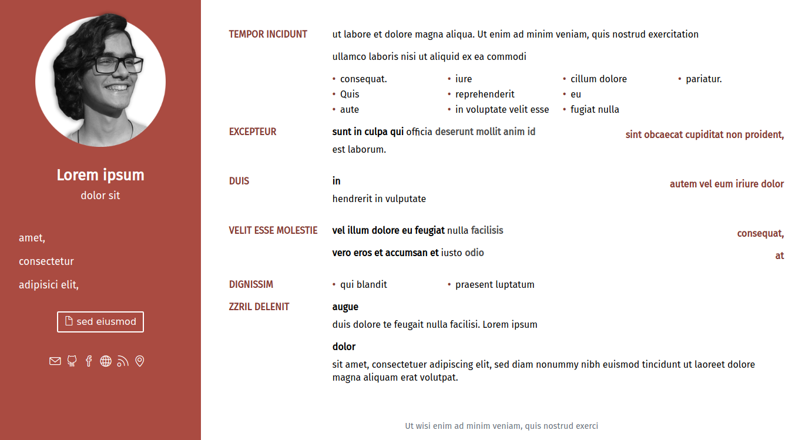
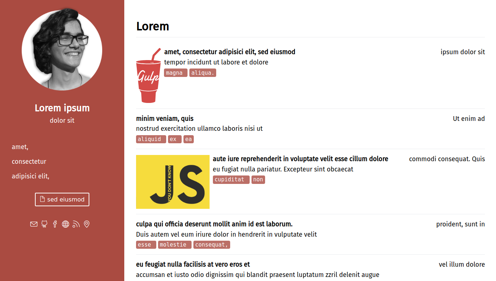
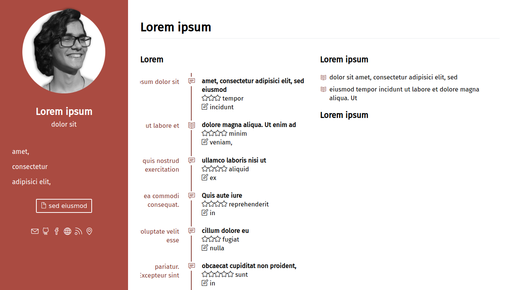

# My personal website (gabrielsimoes.github.io)

 | About page                                     | Blog page                               | Reading list                                    |
 | :--------------------------------------------: | :-------------------------------------: | :---------------------------------------------: |
 |  |  |  |

This is the repository for my website hosted on Github at
[gabrielsimoes.github.io](https://gabrielsimoes.github.io). All source files are
located in the `source` branch, whereas the files which are actually deployed
are located in the `master` branch.

The website is generated using only [Gulp](https://gulpjs.com/), which takes
care of processing all the files in the `notes` folder (which is linked as a
subrepository) and generating the pages.

The HTML and CSS of the page is handled using the [Pug](https://pugjs.org/)
HTML templating engine and [SCSS](https://sass-lang.com/) as a CSS preprocessor.

It features not only an introductory "About Me" page, but also a
reading/watching list and blog, all of which are configured through Markdown
and YAML files in the notes folder. It also generates an atom feed for the blog
and a PDF curriculum.

## How to setup

After cloning the repository, you'd have to run `yarn install` to install
the node dependencies using [Yarn](https://yarnpkg.com/en/). To generate
pages and deploy them, you can use the following gulp tasks:

```bash
gulp build # to generate everything to the dist folder
           # there are also individual tasks for building the assets separately

gulp watch # if you want to watch for changes in the source files and rebuild
           # the website automatically

gulp server # to quickly setup a http server and test the website

gulp dev # will both setup a web server and watch for changes in the files

gulp clean # will delete the dist folder

gulp deploy # this will generate a commit to the master branch, effectively
            # deploying the website quickly.
```

## License

All code is licensed under the MIT license, except where stated otherwise.
